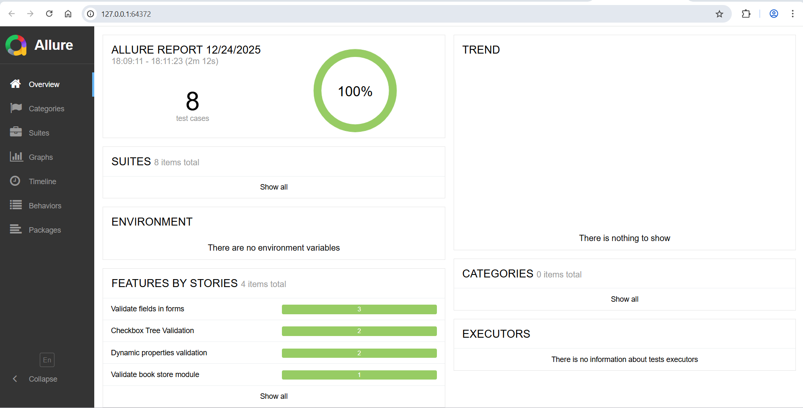

# Automation Framework (Python + Selenium + Behave)
A highly reliable and scalable test automation framework implemented using Python, Selenium, and Behave (BDD).
This framework emphasizes maintainability and flexibility, following modern automation practices to streamline test creation and execution.

### ✨ Key Highlights
- **Behavior-Driven Development (BDD)** using Behave for easy-to-understand and collaborative test scenarios.
- **Page Object Model (POM)** architecture to organize page elements and actions efficiently and promote reusability.
- **Resuable Step Definitions** to reduce duplication and enhance maintainability.
- **Dynamic XPath Handling** to prevent hard-coded selectors and increase robustness against UI changes.
- **Reusability-First Design** ensuring components can be leveraged across multiple test cases.


### 💡 Good to haves implemented
- **Enhanced Logging** to provide detailed insights during test execution, simplifying troubleshooting.
- **Allure Integration** for producing rich, easy-to-read, and visually informative test reports.

---

### 🛠️ Tech Stack
- **Language:** Python 3.8+
- **Automation:** Selenium WebDriver
- **BDD:** Behave
- **Reporting:** Allure
- **Logging:** Python's built-in `logging` module

---

## 📁 Project Structure
```
/demoqa_automation
├── features/              # Main project directory
│   ├── steps/             # Step definitions for Behave
│   │   ├── base_steps.py  # Step definitions for common functionalities
│   │   ├── book_store_steps.py  # Step definitions for Book Store tests
│   │   ├── checkbox_steps.py  # Step definitions for Checkbox tests
│   │   ├── dynamic_properties_steps.py  # Step definitions for Dynamic Properties tests
│   │   ├── forms_steps.py  # Step definitions for form related tests
│   ├── book_store.feature  # Test cases in Gherkin format for Book Store
│   ├── checkbox.feature    # Test cases in Gherkin format for Checkbox
│   ├── dynamic_properties.feature  # Test cases in Gherkin format for Dynamic Properties
│   ├── forms.feature       # Test cases in Gherkin format for Forms
│   ├── environment.py   # Consists of hooks for Behave
├── pages  # Page Object Model (POM) implementation
│   ├── base_page.py        # Common methods for all pages
│   ├── book_store_page.py  # Page class for Book Store related locator variables and methods
│   ├── checkbox_page.py    # Page class for Checkbox related locator variables and methods
│   ├── dynamic_properties_page.py    # Page class for Dynamic Properties related locator variables and methods
│   ├── forms_page.py    # Page class for Forms related locator variables and methods
├── utils   # Utility modules and helper functions
│   ├── logger.py           # Custom logging utility
├── logs   # Captures and stores logs
│   ├── test.log  # Captures test execution logs
├── reports   # Folder to capture allure report related details
│   ├── allure-results/  # Allure results folder
│   ├── allure-report/   # Allure report folder
├── .gitignore           # Git ignore file
├── requirements.txt  # List of dependencies
├── README.md          # Project documentation
└── miscellaneous            # miscellaneous files
     ├── result_demoqa.PNG 


---
| Requirement ID | Description                                                                                                 | Test Case ID        | 🟢 Additional detailing covered in test cases               |
| -------------- | ----------------------------------------------------------------------------------------------------------- | ------------------- | ----------------------------------------------------------- |
| **REQ-1.a**    | Navigate to **Elements → Checkbox** and dynamically expand the tree at all levels                           | TC001               | Dynamic expansion of checkbox tree at all hierarchy levels  |
| **REQ-1.b**    | Select a parent node and dynamically validate that all nested elements display correct icons                | TC002               | Checkbox selection validation for parent-child hierarchy    |
| **REQ-2.a**    | Navigate to **Elements → Dynamic Properties** and wait for the button with text *“Visible after 5 seconds”* | TC003               | Verification of delayed visibility using fluent waits       |
| **REQ-2.b**    | Load the page and verify that the second button changes color after a delay                                 | TC004               | Dynamic color change validation after page load             |
| **REQ-3**      | Navigate to **Forms → Practice Forms** and implement field validation scenarios                             | TC005, TC006, TC007 | Form validation covering happy path and negative test cases |
| **REQ-4**      | Navigate to **Book Store Application** and validate UI book data against API                                | TC008               | UI vs API data comparison for book list validation          |


## ⚙️ Pre-requisites and set up 
**Disclaimer:** Assuming that **windows** is being used as the OS, below are the pre-requisites to set up the project.

### 1️⃣ Clone project repo and navigate to project directory:
```bash
git clone https://github.com/Suvedha-n17/selenium-automation-demoqa.git
```
```bash
cd demoqa_automation
```
### 2️⃣ Python Installation
Check if **Python 3.8+** is installed. Verify python version by executing:
```bash
python --version
```
### 3️⃣ Check and upgrade `pip`

Ensure your `pip` version is **24.0.0 or higher** before installing dependencies.

#### 🔍 Check current `pip` version:
```bash
pip --version
```
#### 🔄 Upgrade `pip` if necessary:
```bash
python -m pip install --upgrade pip
```


### 4️⃣ Set up virtual environment
Create a virtual environment to isolate project dependencies:
```bash
python -m venv venv  # Create virtual environment
venv\Scripts\activate.bat  # Activation command
```
### 5️⃣ Install required packages
Make sure you have **pip** installed.
Run the following command to install required packages:
```bash
pip install -r requirements.txt
```
### 📄To run all feature file- From the project root:
```bash
 behave 
 
### 📄To run specific feature file
```bash
 behave features/forms.feature"
```
```bash
 behave features/checkbox.feature"
```
```bash
 behave features/dynamic_properties.feature"
```
```bash
 behave features/book_store.feature"
```

### 📊 To generate allure report
In order to generate allure report, the **allure CLI** needs to be set up in your system.
#### ✅ Check if allure CLI is installed
```bash
allure --version
```
If you see version output, hurray! No additional steps required. Execute the following command to generate allure report.
### Run tests with Allure formatter
```bash
behave -f allure_behave.formatter:AllureFormatter -o allure-results
```

### Generate report
```bash
allure generate allure-results -o allure-report --clean
```

### Open report
```bash
allure open allure-report
```

---

## 🚫 Ignored Files & Folders
The following are excluded via `.gitignore`:
- `venv/`
- `logs/`
- `screenshots/`
- `allure-results/`
- `allure-report/`
- `.idea/`

---
```
## 🧪 Application Under Test
**DEMOQA Website**  
Automation framework implemented to validate UI functionality using Selenium and Behave.

---

## 👤 Author
Suvedha Nedumaran
---

🔴 If allure CLI is not installed. You could do the following steps to install the same.
#### 🛠️ Allure CLI Installation on Windows
* Download Allure CLI from https://github.com/allure-framework/allure2/releases
* Download the .zip from the latest release.
* Extract the ZIP to a permanent folder (e.g., C:\allure)
* Add to PATH
* Open Windows search → search Environment Variables
* Click Environment Variables
* Under System variables or User variables, find the Path variable → click Edit
* Add the path to the bin folder inside your extracted allure directory (e.g., C:\allure\bin)
* Click OK to save everything
* Verify if allure is installed by opening a **new terminal** and then run the report generation command mentioned **above**.

---
### Allure execution report


The Allure report provides a comprehensive view with pass/fail statistics, execution timeline, detailed step breakdowns, and automatic screenshot attachments for each step.


---